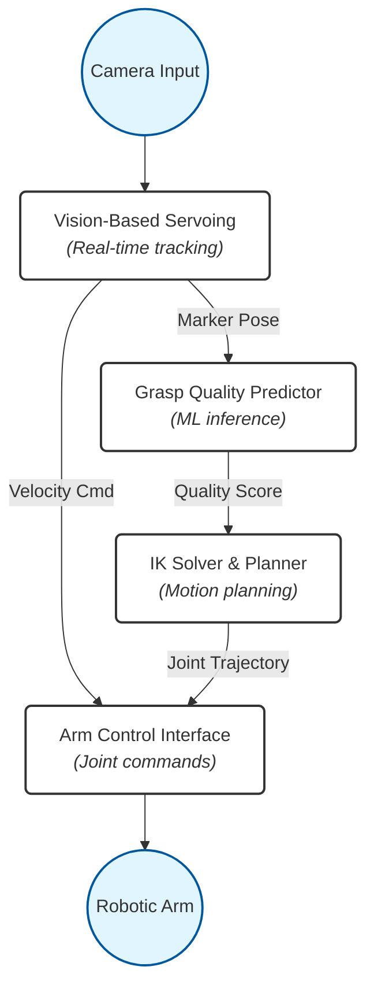
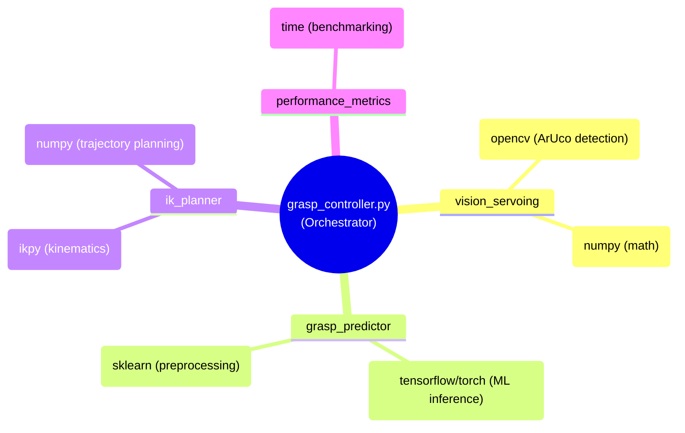

# System Architecture

## Data Flow Diagram
This flowchart captures the hybrid architecture, showing how the Vision node splits its outputs between direct velocity commands and the machine learning pipeline.

# Module Dependencies
## This mindmap visually represents how the Master Controller orchestrates the sub-modules and their respective libraries.

# ROS 2 Node Graph
## This represents the ROS 2 pub/sub network flowing horizontally.
